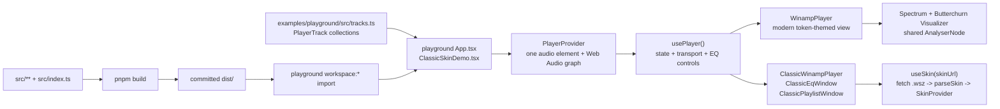

# Winamp architecture

This document describes the architecture that is present on `origin/main`.
It is a map of the current implementation, not a roadmap.

## Runtime data flow

The library keeps audio state in one provider and lets multiple views render or
control that state. The playground supplies the track data and exercises both
view families.



The flow is:

1. A host passes a `PlayerTrack[]` collection to `PlayerProvider`. Tracks can
   omit `audioUrl`; those tracks remain visible to playlist views but are not
   playable.
2. `PlayerProvider` renders the one hidden `<audio>` element, tracks transport
   state, and exposes the `usePlayer()` context. It creates the Web Audio graph
   lazily on the first user-initiated play.
3. `WinampPlayer` and the classic windows are views over that context. They can
   be rendered separately or together under the same provider, so their
   transport, current track, EQ, balance, shuffle, repeat, and analyser state
   stay shared.
4. The modern view reads the shared `AnalyserNode` for its spectrum and passes
   it to the browser-only Butterchurn visualizer when the visualizer is
   available.
5. Each classic window loads its `skinUrl`, receives the parsed skin through
   `SkinProvider`, and uses the same player context for its controls.
6. The playground's `App.tsx` and `ClassicSkinDemo.tsx` are host examples, not
   a second player engine. Its `tracks.ts` collections are the input data.

## Public boundaries and extension points

The package public surface is the root export in
[`src/index.ts`](../src/index.ts). Consumers should import from
`@walkswithaswagger/winamp` and the two documented CSS subpaths; files under
`src/` are implementation modules unless they are re-exported there.

### Provider and `usePlayer`

`PlayerProvider` is the composition boundary. It accepts:

- `tracks: PlayerTrack[]`, the deliberately small host-owned track model;
- `onNowPlaying?: (info: NowPlaying) => void`, the host callback for reacting
  to a selected track; and
- `children`, which must contain every view or custom control that calls
  `usePlayer()`.

`usePlayer()` is the extension point for a custom React view. Its public value
contains current track and transport state, the `AnalyserNode`, EQ state and
setters, balance/shuffle/repeat state and setters, and the `cue`,
`playTrack`, `toggle`, `next`, `prev`, `seek`, and `setVolume` actions. It throws when
used outside a provider, so a custom view must stay inside the provider
boundary.

The provider owns browser integration and audio graph construction. A host
does not replace the `<audio>` element or inject an audio engine. A host can
observe now-playing changes through `onNowPlaying` and can build another view
on top of the context.

The core exports are `PlayerProvider`, `usePlayer`, `EQ_BANDS`,
`EQ_MAX_DB`, `PlayerTrack`, and `NowPlaying`. The keyboard shortcut hook
and `usePrefersReducedMotion` are also public helpers for custom views.

### Modern `WinampPlayer`

`WinampPlayer` is a view-level component. Its current prop boundary is:

| Prop | Purpose |
| --- | --- |
| `theme` | Selects one exported `DeckTheme` pack. This is distinct from classic `.wsz` skins. |
| `storageKey` | Names the local-storage state for position, size, and EQ preset. |
| `wordmarkSrc` / `wordmarkText` | Replace the title-bar mark or text. |
| `spectrumColors` | Overrides the modern spectrum bar palette. |

Modern visual customization is through the CSS custom properties in
`styles.css` (including the `--wamp-*` tokens and `--deck-accent`) or
through the exported `THEMES`, `DeckTheme`, and `ThemePack` definitions.
Adding a built-in named pack requires a source change in `src/themes.ts`; there
is no runtime plugin registry.

For a different interaction model, use `usePlayer()` to build a custom view
instead of reaching into `WinampPlayer` internals. The exported keyboard hook
is another way to attach the standard media controls to that view.

### Classic windows and skin extension points

The classic view family is composed of three independent components. Each
requires a `skinUrl` and accepts `scale` and `storageKey`:

- `ClassicWinampPlayer` renders the main transport window and classic spectrum.
- `ClassicEqWindow` maps its ten band sliders and preamp to the provider's EQ.
- `ClassicPlaylistWindow` renders `allTracks` and calls `playTrack` for
  playable rows.

All three must be descendants of `PlayerProvider`. They can share the same
`skinUrl`, but each window loads it through its own `useSkin` call; the
parser cache shares an in-flight or completed load by URL.

Lower-level classic exports support custom classic layouts: `useSkin`,
`parseSkin`, `parseViscolor`, `parsePledit`, `SkinProvider`,
`useSkinContext`, `Sprite`, `SpriteButton`, `Slider`,
`ClassicVisualizer`, the bitmap readouts, `SKIN_SPRITES`, `SPRITE_DIMS`,
`SpriteDef`, `SpriteName`, and `skinMuseumUrl`. A custom window can use
the parsed `Skin` from the skin context and the shared player context without
duplicating fetch or audio state.

### Skin parsing boundary

`useSkin(url)` fetches a URL, reads its `ArrayBuffer`, and calls
`parseSkin`. `parseSkin` unzips a `.wsz`, decodes browser-supported BMP
files, crops the known sprite definitions to data URIs, and reads
`viscolor.txt` and `pledit.txt` when present. The result is a `Skin` with
sprite data and colors.

Loading is asynchronous. `useSkin` reports `loading`, `ready`, or `error`
and does not throw fetch or parse failures into the render tree. A failed load
returns no parsed skin so the classic view can render its fallback/status
state. `parseSkin` itself is the lower-level async parser and expects a
browser environment with the image and canvas APIs it uses.

### Package exports and CSS

`src/index.ts` is the source of the JavaScript and type export surface. The
package manifest maps the built package to:

- `@walkswithaswagger/winamp` → `dist/index.js`, `dist/index.cjs`, and their
  declarations;
- `@walkswithaswagger/winamp/styles.css` → `dist/styles.css`; and
- `@walkswithaswagger/winamp/skins.css` → `dist/skins.css`.

`styles.css` is the base modern deck styling. `skins.css` is an optional
graphic-skin font/style import. Both CSS files are package side effects and
are copied into `dist/` by the build.

## Browser and external-input boundaries

The library is client-only. Components use the `"use client"` directive and
several features touch browser-only APIs. SSR-compatible applications should
render the package from a client boundary.

### Web Audio and media URLs

The provider's graph is built lazily on the playback path: `<audio>` → preamp
→ ten peaking EQ filters → analyser → stereo balance → destination. This is
deliberate because browsers may block `AudioContext` creation or resume before
a user gesture.

The audio element uses `crossOrigin="anonymous"`. Remote `audioUrl` values
therefore need a CORS response that permits the requesting site if the Web
Audio analyser, EQ, or visualizers are expected to read the media. Same-origin
files in the playground do not need extra CORS configuration. The player does
not proxy or repair external media responses.

`cue(id)` selects and loads a track without calling `play()`. It is suitable
for deep links or initial display state, but it does not bypass autoplay policy.
Actual playback still requires a permitted user gesture and a media URL that
the browser can load.

### Butterchurn

The modern visualizer is an optional browser path. `Visualizer` dynamically
imports `butterchurn` and its preset bundle after the provider has exposed an
`AnalyserNode`; it then connects that analyser to a canvas renderer. The
modern deck also gates the visualizer on browser capabilities such as WebGL2,
viewport size, and reduced-motion preference. A missing or unsupported
visualizer does not replace the audio engine.

### `.wsz` skins

`skinUrl` is an external input. The URL must be reachable by browser
`fetch` with CORS enabled, including for URLs hosted on the Skin Museum or
another origin. The response must be a valid Winamp `.wsz` archive containing
the assets the parser can decode; missing optional color files use parser
defaults.

The parser dynamically imports `fflate`, so the modern deck does not pull the
classic unzip dependency into its initial path. BMP decoding and sprite
cropping use `createImageBitmap`, `Blob`, `CanvasRenderingContext2D`, and
`toDataURL`, which is why this path is browser-only. Parser or fetch failures
are represented by the `useSkin` status boundary described above.

## Build output and generated files

`dist/` is committed intentionally. The package manifest publishes only
`dist/`, and its import, require, type, and CSS export targets all point there.
The source of truth remains `src/` plus the CSS files under `src/`.

From the root package manifest:

```bash
pnpm build
```

This runs `tsup` for ESM, CommonJS, declarations, and source maps, copies
`src/styles.css` and `src/skins.css`, and restores the client directive in
the bundled output. `pnpm check:dist` rebuilds and then runs
`git diff --exit-code -- dist`; it fails when generated output differs from
the committed files.

Run dist-producing commands in an isolated worktree and inspect any generated
diff before handing work off. Do not overwrite or clean unrelated `dist/`
changes in another checkout.
